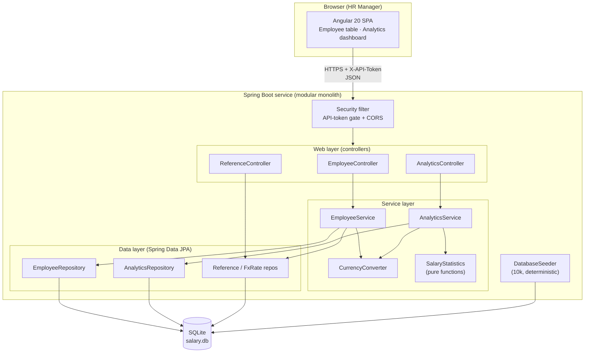
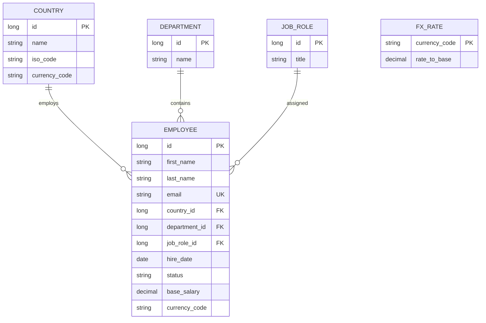
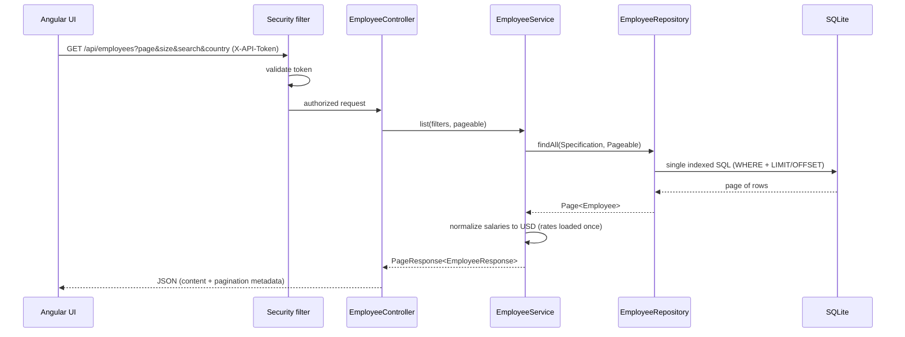
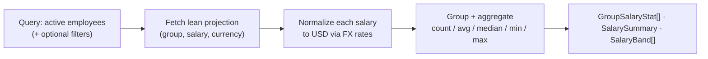

# Architecture Diagram

Visual companion to [`architecture.md`](architecture.md). Diagrams use Mermaid so
they render directly on GitHub.

## System overview

## Data model

`FX_RATE` has no foreign key to employees by design: it is a small fixed lookup
table used by the service layer to normalize `base_salary` (in the employee's
local `currency_code`) to the base currency (USD) for analytics.

## Request flow: paginated employee list

## Analytics flow: normalize-then-aggregate

Salaries are stored per local currency, so normalization to USD happens **before**
aggregation. A plain SQL `AVG(base_salary)` would incorrectly mix currencies.
